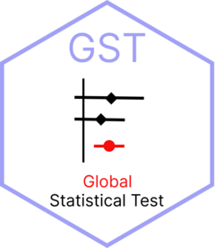

# gst 

Assessing sample size and power, and presenting consolidated evidence

## Description

The {gst} package provides a toolbox for assessing sample size and power for Global Statistical Tests across a variety of scenarios, and presenting consolidated evidence using a forest plot.

## Shiny Apps

The {gst} package includes two shiny applications. For details on how to use the apps, please review the vignettes.


### GST Power App

```
library(gst)
gst_power_app()
```

### Make Forestplot App

```
library(gst)
make_forestplot_app()
```
