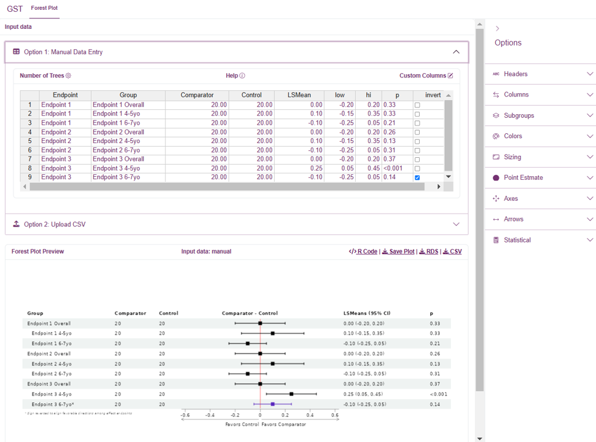
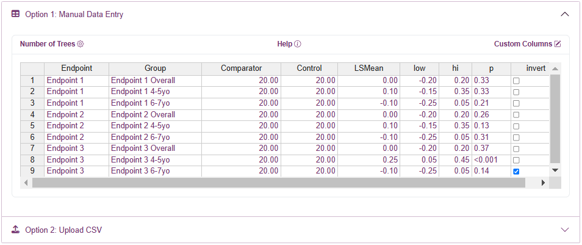
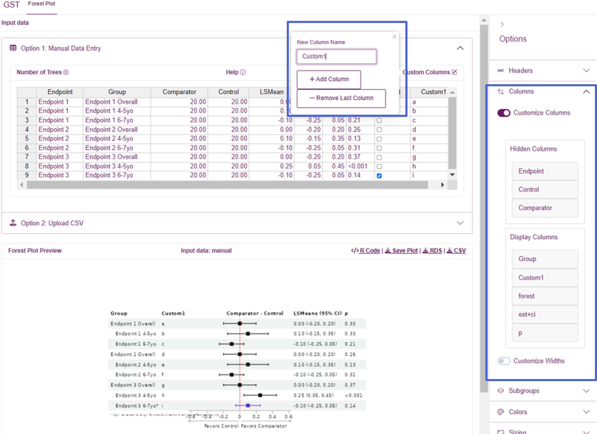
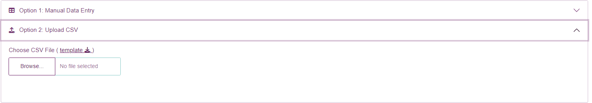
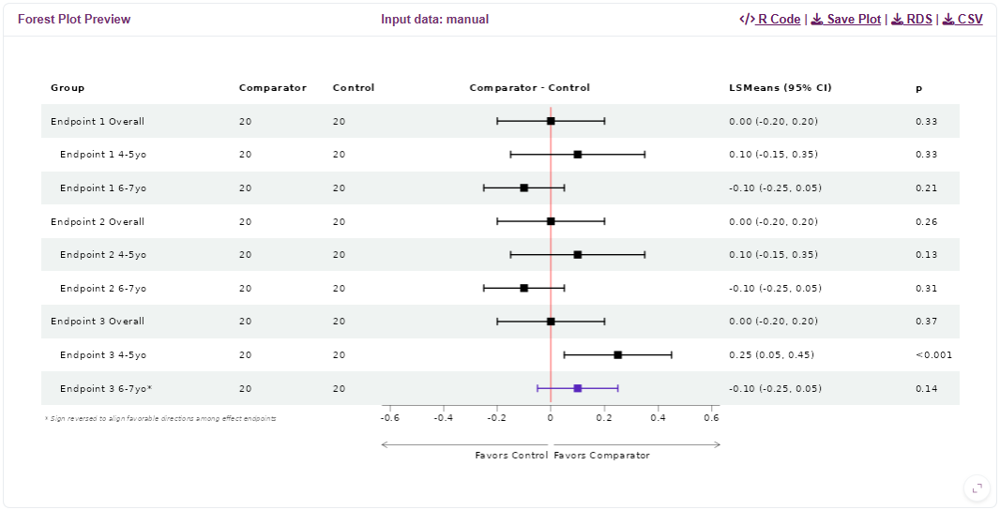

# Make Forestplot App

Make Forestplot App is a simple shiny application for displaying
consolidated evidence as a forest plot.

## Input Data

You can either enter data manually, or import your data using a csv
file.

### Manual Entry (using rhandsontable)

For manual data entry, we use the `rhandsontable` widget that is similar
to Excel. Once you have selected the number of trees (i.e., rows), you
can type your data directly into the cells. Alternatively, you can
copy/paste directly from Excel. Click a cell to edit the data within, or
drag rows to rearrange their order. In addition to setting the number of
trees, you can also add/remove rows by using the right-click menu.

*Please note that you can click column headers to sort the data, but
sorting will not be reflected until further cell edits are made; this is
a current drawback of rhandsontable.*

#### Custom Columns

Use the ‘Custom Columns’ popover to add or remove custom columns. These
columns will default to string/text entry, so they can handle both
numeric and text data.

Once column(s) have been added to the table and populated with the data,
go to the ‘Columns’ Options and toggle ‘Customize Columns’ on to include
the new column(s). Drag columns into the ‘Display Columns’ section to
specify the included columns and their ordering. If the default sizing
does not look good, use the ‘Customize Widths’ option to fine-tune the
width for each column

When customizing columns, two special column names are:

- `est+ci`: the estimate and confidence interval column
- `forest`: forestplot image column

You are required to include the `forest` column, while the `est+ci`
column is optional.

### Upload CSV

Make Forestplot App also let’s you upload a CSV file. The column
ordering is critical, so we provide a template to assist with the csv
upload process.

If the import process is successful, the resulting data will be
displayed in a static (uneditable) rhandsontable and you will receive a
message that the import was successful. You should be able to see the
resulting forestplot in the preview pane.

If the import is not successful, you will receive a message indicating
failure. Please review the template to see if you may have made any
errors. If you still are not able to import, please contact the IdeaR
team.

One benefit of using the Upload CSV method is that you can provide
custom names for the ‘Comparator’, ‘Control’, and ‘LSMean’ columns and
then these will be immediately populated in the forestplot. This saves
you the additional step of customizing your Headers in the right sidebar
options menu.

Custom columns can also be provided when uploading a CSV. Any custom
columns should be placed **after** the `invert` column. See [Custom
Columns](#custom-columns) for details on controlling displayed columns
and their widths.

## Preview

Once data is provided, the resulting plot is displayed immediately in
the preview pane.

After preparing your data, you can collapse the accordion to provide
additional space for previewing the results. The active dataset will be
indicated in the headers, but it will always be the data from the most
recently used method (manual or upload).

Use the options in the upper-right corner to export the image, the input
data, or the R code used to generate to forestplot (see
[Exports](#exports)).

## Plot Options

Adjust your plot using options located on the right sidebar. The plot
will be updated dynamically as you make adjustments to help you achieve
the desired outcome.

Below we provide a list of options and their purpose:

| Group          | Option                          | Description/Purpose                                                                                                                                                                                                                  |
|----------------|---------------------------------|--------------------------------------------------------------------------------------------------------------------------------------------------------------------------------------------------------------------------------------|
| Headers        | (Group, …, p)                   | Change the name of the respective forestplot column                                                                                                                                                                                  |
| Columns        | Customize Columns               | Toggle ON to customize the table columns and their ordering                                                                                                                                                                          |
| \-             | Customize Widths                | Toggle ON to customize the width of each column                                                                                                                                                                                      |
| Subgroups      | Indent subgroups                | Should subgroups be indented?                                                                                                                                                                                                        |
| \-             | Keyword for nonsubgroups        | Keyword for identifying which rows are NOT subgroups (i.e., the group-level rows)                                                                                                                                                    |
| Colors         | Color by Endpoint               | Add background color to endpoint (i.e., groups)?                                                                                                                                                                                     |
| \-             | Confidence Intervals - Normal   | Hex color for drawing the non-inverted confidence intervals                                                                                                                                                                          |
| \-             | Confidence Intervals - Inverted | Hex color for drawing the inverted confidence intervals                                                                                                                                                                              |
| Sizing         | Row Height                      | Forestplot row heights                                                                                                                                                                                                               |
| \-             | Base Font Size                  | Forestplot base font size                                                                                                                                                                                                            |
| \-             | CI T-Height                     | Length of the T located at the end of the confidence interval whiskers                                                                                                                                                               |
| Point Estimate | Point Estimate Shape            | Shape of point estimate in the forestplot                                                                                                                                                                                            |
| \-             | Point Estimate Size             | Size of the point estimate in the forestplot                                                                                                                                                                                         |
| Axes           | Zoom Level                      | Size of the x-axis relative to the confidence intervals. Set to 100% to have the narrowest view while still seeing all confidence intervals; set to 0% to have the widest view, with plenty of space beside the CIs                  |
| \-             | Symmetric Range                 | Should the forestplot have a symmetric range for the x-axis?                                                                                                                                                                         |
| \-             | Customize Forest Ticks          | Should the forestplot have custom tick marks along the x-axis, or use the pre-defined values?                                                                                                                                        |
| \-             | Forest Ticks                    | Comma-separated list of custom values for the x-axis tick marks below the forestplot                                                                                                                                                 |
| Arrows         | Arrow Prefix                    | Prefix for the arrow labels                                                                                                                                                                                                          |
| \-             | Customize Arrow Labels          | Use a custom label for the arrows? Default is to use the column headers                                                                                                                                                              |
| \-             | Left Arrow Label                | Custom label for the left-facing arrow                                                                                                                                                                                               |
| \-             | Right Arrow Label               | Custom label for the right-facing arrow                                                                                                                                                                                              |
| \-             | Flip Arrow Labels               | Should labels on the directional arrows below the forestplot that indicate which group is better be flipped? (Note: This is useful when all endpoints are inverted)                                                                  |
| Statistical    | Standardize Plot                | Should the forestplot display be standardized? To standardize, we divide by the standard error so that all CIs have equal length. This can be helpful when numeric results are on very different scales                              |
| \-             | Confidence Level                | Confidence level used for the provided lower/upper limits. This is used in the forestplot header label, but also is important when Standardize Plot is ON. (Warning: This should match the confidence level used in your input data) |
| \-             | Rounding                        | Should the estimate and confidence interval be rounded?                                                                                                                                                                              |
| \-             | Number of Digits                | Number of digits for rounding the estimate and confidence interval                                                                                                                                                                   |

## Features

### LSMean scaling

Forestplot results are displayed in the original scale by default, but
there is also the option to standardize the displayed estimate and
confidence interval. LSMeans and confidence intervals are standardized
by dividing by the standard error, so for a 95% confidence interval the
forest plot bars will be 1.96. Numerical results of the LSMeans are on
the original scale (without SE adjustment) along with P-values
(unadjusted nominal).

### Favorable Direction

Arrows along the bottom of the forestplot indicate which direction is
favorable for the Comparator and Control groups. The assumption is that
larger values indicate better outcomes. However, for outcomes with an
inverse relationship you can identify them using the `inverted` column
and the resulting forest plot bars will be reversed such that the
favorable directions are aligned across outcomes. For these inverted
outcomes, the numerical results will remain unchanged.

Additionally, if all endpoints are reversed then you have the option to
instead use the ‘Flip Arrow Labels’ option. This will reverse the labels
on the directional arrows below the forestplot to reflect all endpoints
being inverted. When you do this, make sure you keep the ‘inverted’ box
unchecked for all endpoints, as this ‘inversion’ is now being accounted
for by flipping the directional arrows and we no longer need to reverse
direction for the individual confidence intervals.

### Dynamic Resizing

The plot is designed to dynamically resize to the browser window. We
recommend you adjust the browser size as you adjust options in order to
achieve the desired result.

### Exports

Once you have finished creating your forestplot, you have the option to
export it as a PNG or JPEG file. Use the ‘Save Plot’ button to load an
image preview, and adjust the width and height to customize the output
image before downloading.

For accessing the raw input data, we provide CSV and RDS exports.

Finally, we also provide the code snippet used to generate the forest
plot so that you can reproduce it in your own R environment, or make
further adjustments.

### Extending Functionality

If there are additional features you’d like to see, please contact the
IdeaR team.

For R users, we also provide the code to replicate the plot you create.
Within the
[`forest_plot()`](https://sarepta-therapeutics.github.io/gst/reference/forest_plot.md)
function we allow you to pass arbitrary arguments to the
[`forestploter::forest_theme()`](https://rdrr.io/pkg/forestploter/man/forest_theme.html)
function, which allows further visual customization. Please check the
documentation for further details.
