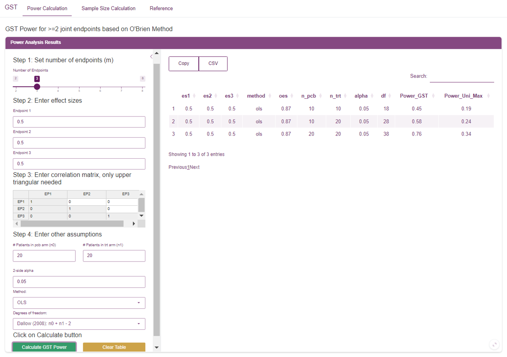
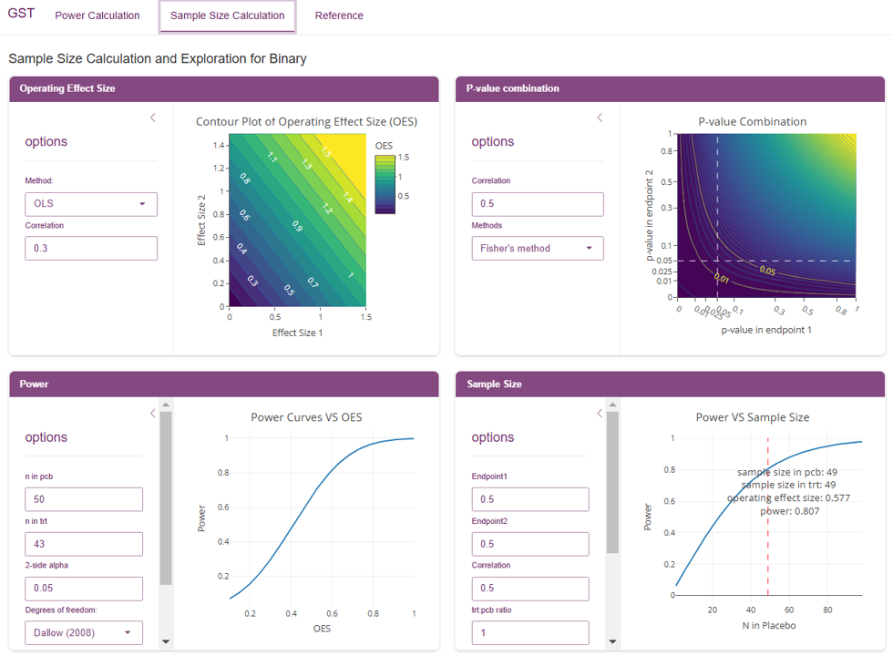
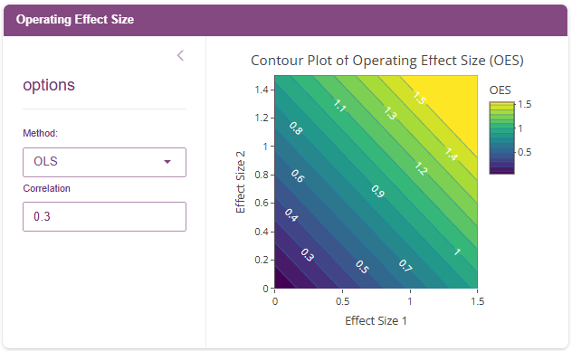
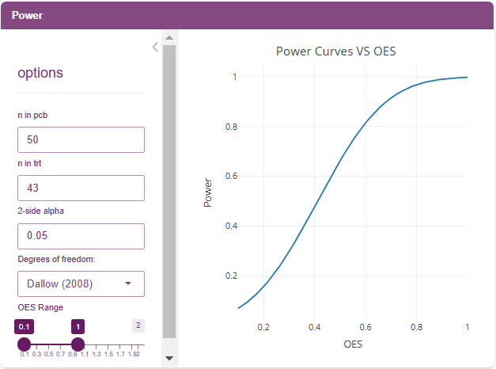
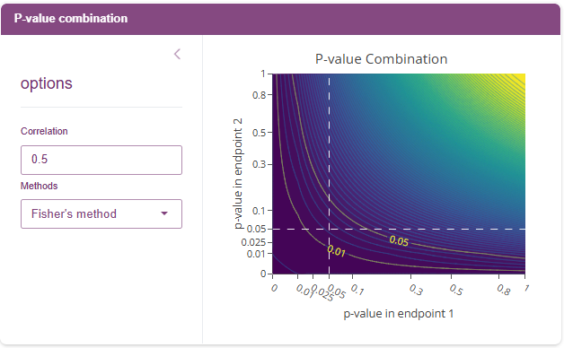
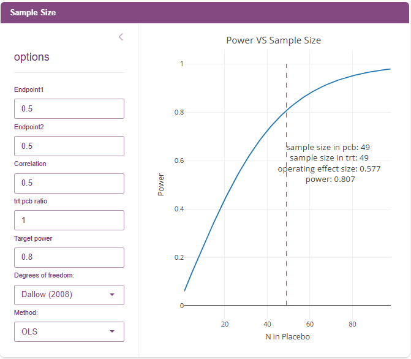

```{r, include = FALSE}
knitr::opts_chunk$set(
  collapse = TRUE,
  comment = "#>"
)
```



The GST Power App is a shiny application for generating power and sample size calculations based on the Global Statistical Test (GST).  In addition to power calculations for more than two endpoints, it provides a variety of widgets to explore GST results under different settings for the special case of exactly two endpoints.

----

## Power Calculation

The 'Power Calculation' tab is for generating power calculations based on the global statistical test (GST) for two or more joint endpoints.  Below is a step-by-step walkthrough 

### Step 1: Set number of endpoints (m)

Choose how many joint endpoints you plan to evaluate.  Currently, you can choose between 2 and 8 endpoints

### Step 2: Enter effect size

For each of your endpoints, provide the effect size.  There will be one effect size for each of the `m` endpoints specified in step 1.

### Step 3: Enter correlation matrix, only upper triangular needed

Use this matrix to add correlation to your endpoints.  Values should be between -1 and 1, and 0 indicates endpoints are not correlated.  When entering correlations, a given cell with row index $i$ and column index $j$ will contain the correlation between endpoints $i$ and $j$.  The correlation matrix is symmetric so you only need to enter values in the upper triangle of the matrix.

### Step 4: Enter other assumptions

Here you can provide additional assumptions, including:

  - Sample sizes for the control and treatment groups
  - 2-side alpha (i.e., significance level)
  - Fit Method -- choose betweeen OLS (default) and GLS
  - Degrees of Freedom -- choose between Dallow (default), O'Brien, and Logan and Tamhane
  
### Step 5: Calculate

After completing setup, click the 'Calculate GST Power' button.  Results will be displayed in a single row of a table in the center of the application.  In addition to the chosen settings, the column 'Power_GST' will provide the power for the GST and the 'Power_Uni_Max' column contains the maximum power among all endpoints when tested individually.  The results table can be saved using the CSV button.

Repeatedly clicking the 'Calculate GST Power' button will append a row to the table with the current settings.  This allows the user to generate power calculations for multiple scenarios, which can be saved and then shared with others.

----

## Sample Size Calculation



The 'Sample Size Calculation' tab provides four separate widgets specifically for exploring GST with two endpoints.  The goal is to provide a holistic toolbox for understanding and evaluating GST with two endpoints by including multiple visualizations and flexible options that can capture a variety of potential study scenarios.

> Any of these widgets can be viewed in full-screen mode by clicking the bubble in the lower-right corner of the widget

### Operating Effect Size



This widget provides a visualization of how the individual effect sizes impact the GST Operating Effect Size (OES).  Hovering over a point reveals the individual effect sizes and the GST OES.

In the sidebar, options include:

  - Fit Method -- chose between OLS and GLS
  - Correlation -- set to a value between -1 and 0
  
Updating the correlation is an important feature because it provides insight into how correlation between endpoints can impact the GST OES.  For fixed individual effect sizes, the OES GST will decrease as the correlation increases.

### Power



This widget provides a visualization of GST Power (y-axis) as a function of GST OES (x-axis).  It can be helpful for determining the minimum OES to achieve the desired power based on a fixed sample size.

Sidebar options include:

  - Number of subjects in placebo/control group
  - Number of subjects in treatment group
  - 2-side alpha (i.e., significance level)
  - Degrees of Freedom -- choose between Dallow (default), O'Brien, and Logan and Tamhane
  - Display range for the OES

### P-value Combination



This widget provides a visualization of how individual endpoint p-values influence the GST p-value.  The dotted white lines indicate .05 and .01 significance thresholds for individual endpoints, and the yellow curves show the joint endpoint GST thresholds at .05 and .01 significance.  Hovering over any given point will display the corresponding individual endpoint and joint GST p-values.

Sidebar options include:

  - Correlation (between endpoints) -- ranges from -1 to 1
  - Methods - choose between Fisher's (default) or Stouffer's
  
One feature of GST that is evident in this visualization is the "sweet spot" (above the dotted lines but below the curve for a given significance level) where we can have non-significant individual endpoints but still have a significant effect in the joint endpoint via GST.

### Sample Size



This widget provides a visualization of GST Power (y-axis) as a function of sample size (x-axis) under a variety of scenarios for two endpoints.  This can be useful for determining how many subjects will be needed to reach target power, based on the settings/assumptions.

Sidebar options include:

  - Effect size for Endpoint 1
  - Effect size for Endpoint 2
  - Correlation (between endpoints) -- ranges from -1 to 1
  - Ratio of subjects in treatment vs placebo/control group (trt:pcb ratio)
  - Target power -- ranges from 0 to 1 (default: 0.8)
  - Degrees of Freedom -- choose between Dallow (default), O'Brien, and Logan and Tamhane
  - Fit Method -- chose between OLS and GLS
  
Based on the target power, the resulting plot will provide the minimum sample size for each group and the GST OES.

----

## References

The 'References' tab contains details on the methodology used in this application.
